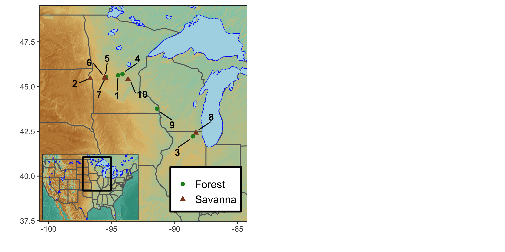

# TreeRings
Tree ring analyses after cofecha crossdating & bayesian models of tree ring growth, Water Use Efficiency, and &delta;13C .

This repository holds the code used to quantify the effects of climate, tree size, stand strucutre, and CO2 on tree ring growth across the savanna-forest boundary region in the Uppermidwest US. Specifically, we develop bayesian heiarchical models to understand the joint effects of multiple envirmental factors on tree growth across 9 sites in the upper midwest. 

It also houses a variety of general scripts used to process tree ring widths, growth sensitivities to climate, and site level differences in climate sensitivity. 

# Contents:

### R/manuscript_code:
Contains R code to run jags bayesian models of tree ring growth  and bayesian models of water use efficiency and &delta;13C . Analysis covers 9 sites across the upper midwest US, spanning the savanna-forest boundary.

#### Code used to run bayesian models and generate figures in the manuscript

- Aggregation of tree ring rwls into a single dataframe, with associated climate data, and back-calculated tree diameter are is conducted in **RW_trends.R** (calls code from **tree_age_agg.R**)
- Separation of ring width and iWUE data into testing and training datasets conducted in **clean_separate_data.R** (Requires outputs from **RW_trends.R** & **calc_WUE.R**)
- All bayesian models (including the selected model) explored in this analysis are detailed in **RWI_models.Rmd** 
- Selected tree ring growth model is run in **RWI_bayes_model.R** (run with globally scaled covarate data)
- Selected tree ring growth model after doing cohort/structure covariate scaling is in **RWI_bayes_model_scaled_struct_cohort.R**
- Chosen WUE and &delta;13C bayesian heiarichical models are in **WUE_bayes_model**
- Paper figures for the manuscript are generated in **Paper_figures.R** (global scaling) & **Paper_figures_cohort_struct_scaled.R**
- Summary tables are generated in **Summary_tables.Rmd**
- WUE tables are generated in **WUE_d13C_model_tables.Rmd**

#### Code used to clean up and calculate WUE from &delta;13C  values
- R code used to read in all the &delta;13C  values, correct for the suess effect and do some  preliminary plotting and cleaning of the data in **read_plot_deltaC.R**
- R code used to calucluate intrinsic water use efficiency from the stable isotope values output from **read_plot_deltaC.R** is **calc_WUE.R**

### R/Preliminary_analyses:
Contains R code for detrending tree ring widths, and conducting preliminary correlations with climate for each site. 

### UNDERC_training folder
Contains rcode used to train and demonstrate basic climate correlations and stand mapping for tree ring analyses

- Basic detrending options in dplr are in **dplR_detrend.R**
- Some code to generate stand maps from plot coordinates is in **UNDERC_plot_maps.R**
- A basic guide to generating tree ring growth - climate correlations/responses is in **Climate_response_UNDERC.R**

### R/Preliminary_analyses/Isotopes
Contains the code used to read in IRMS data and do standard corrections.

- R code used to read in IRMS raw data and correct for standards **IRMS_Data_Process_Raw.R**
- R code used to identify potential years with similar climate to do sampling on is in **Picking_isotope_years.R**

# Data used in this manuscript are archived on NIS
-Stable Isotope & iWUE data:
Heilman, K. 2020. Quercus spp Tree Ring Isotopes, Midwest US ver 0. Environmental Data Initiative. https://doi.org/10.6073/pasta/5fb5ebba1cef5c236aba80f32aa771a7 (Accessed 2021-02-18).

-Tree Ring data are archived in site-level zip files:
Heilman, K. 2020. Tree Rings, Avon Hills Scientific and Natural Area, Minnesota ver 0. Environmental Data Initiative. https://doi.org/10.6073/pasta/eba1457b8ea2b2da9d7413bca501cd2a (Accessed 2021-02-18).

Heilman, K. 2020. Tree Rings, Bonanza Prairie Scientific and Natural Area ver 0. Environmental Data Initiative. https://doi.org/10.6073/pasta/fc86ca8a52ea170b36ff9456f83b5682 (Accessed 2021-02-18).

Heilman, K. 2020. Tree Rings, Englund Ecotone Scientific and Natural Area, Minnesota ver 0. Environmental Data Initiative. https://doi.org/10.6073/pasta/010be23542658a4cd0e93fd1be6277d8 (Accessed 2021-02-18).

Heilman, K. 2020. Tree Rings, Glacial Park, McHenry County Conservation District, Illinois ver 0. Environmental Data Initiative. https://doi.org/10.6073/pasta/13a05a445fb73b319401fdcfef011935 (Accessed 2021-02-18).

Heilman, K. 2020. Tree Rings, Glacial Lakes State Park Site 1, Minnesota ver 0. Environmental Data Initiative. https://doi.org/10.6073/pasta/70449da6c90055d7b614e8dc2998ba42 (Accessed 2021-02-18).

Heilman, K. 2020. Tree Rings, Glacial Lakes State Park Site 2, Minnesota ver 0. Environmental Data Initiative. https://doi.org/10.6073/pasta/5427c7526f48424fcd8a50474ca20380 (Accessed 2021-02-18).

Heilman, K. 2020. Tree Rings, Glacial Lakes State Park Site 3, Minnesota ver 0. Environmental Data Initiative. https://doi.org/10.6073/pasta/a20a2311145bba28181cea354d9cb505 (Accessed 2021-02-18).

Heilman, K. 2020. Tree Rings, Mound Prairie Scientific and Natural Area, Minnesota ver 0. Environmental Data Initiative. https://doi.org/10.6073/pasta/157f332c116923026be7d781c4f06956 (Accessed 2021-02-18).

Heilman, K. 2020. Tree Rings, Uncas Dunes Scientific and Natural Area, Minnesota ver 0. Environmental Data Initiative. https://doi.org/10.6073/pasta/6229c214814dc38a7bf11cfd57e01eaf (Accessed 2021-02-18).

Please cite the manuscript if using these data, and/or the code:
[I'll update manuscript citation details here, once accepted]

